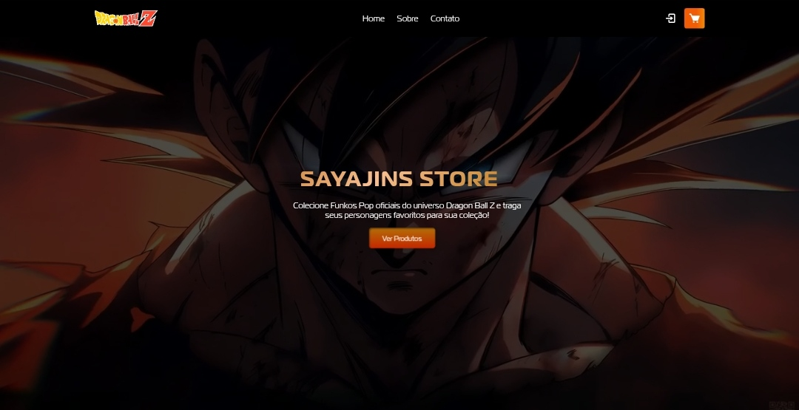

# 🛍️ Sayajins Store

## 📘 Disciplina
**Desenvolvimento Web I**  
Professor: **Bruno Zolotareff** — Professor de nível superior e pesquisador  

---

## 🌐 Projeto Publicado
🔗 [Acesse o site aqui](https://erick-silva8.github.io/dbz-loja/)

---

## 👥 Integrantes do Grupo
- Érick Silva  
- Gustavo Matos  
- Luiz Menezes  
- Ryan Santos  
- Janelson Araújo  
- Carlos Eduardo  
- Fagner Cardoso  

---

## 🧾 Descrição do Projeto

Nos foi solicitado o desenvolvimento de um site de **loja virtual**, utilizando **HTML5**, **CSS3**, **JavaScript** e a biblioteca **Bootstrap**.  
O projeto deveria abordar um dos dois temas propostos: **Dragon Ball Z** ou **Naruto**.  

Optamos pelo desenvolvimento de uma **loja virtual de Funkos Pop inspirada no universo Dragon Ball Z**, nomeada **“Sayajins Store”**.  
O site apresenta uma interface moderna, responsiva e atrativa, permitindo vis ualizar produtos, adicionar itens ao carrinho e navegar entre as páginas *Home*, *Sobre* e *Cadastro*.  

O design foi inteiramente desenvolvido pelo grupo, sem uso de templates prontos, buscando originalidade, organização e usabilidade.

---

## 🖼️ Tela Principal

